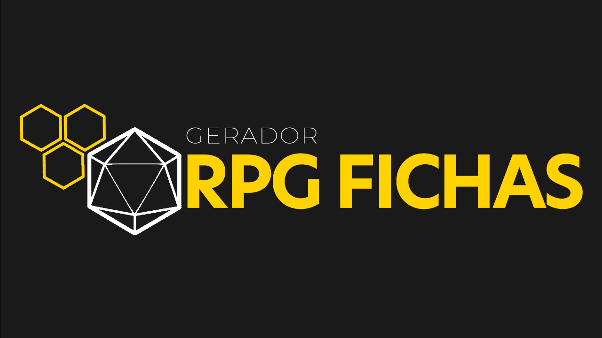

  

Projeto que gera fichas de RPG de mesa de forma dinamica!

  <a href="#-tecnologias">Tecnologias</a>&nbsp;&nbsp;&nbsp;|&nbsp;&nbsp;&nbsp;
  <a href="#-descrição">Descrição</a>&nbsp;&nbsp;&nbsp;|&nbsp;&nbsp;&nbsp;
  <a href="#-funcionalidades">Funcionalidades</a>&nbsp;&nbsp;&nbsp;|&nbsp;&nbsp;&nbsp;
  <a href="#-preview">Preview</a>

 

## 🚀 Tecnologias
Esse projeto foi desenvolvido com as seguintes tecnologias:
- [HTML5](https://html.com/)
- [CSS3](https://developer.mozilla.org/pt-BR/docs/Web/CSS)
- [Typecript](https://www.typescriptlang.org)
- [React](https://react.dev)
- [Node](https://nodejs.org/en)
- [Tailwind](https://tailwindcss.com)
- [PostgreSQL](https://www.postgresql.org)
- [Git](https://git-scm.com)

 
 

## 📖 Descrição
Este projeto é um sistema web desenvolvido para facilitar a criação de fichas de personagens para jogos de RPG de mesa. O sistema permite gerar fichas de forma dinâmica, preenchendo informações relevantes sobre o personagem, como atributos, habilidades, equipamentos e entre outros fatores. Vale ressaltar que esse projeto é para gerar fichas de um RPG de mesa de tipo fantasia, com sua ênfase na narrativa e na exploração de temas como poder, ética e a natureza da realidade. Desenvolvido em conjunto com outros colaboradores, ainda não está acessível ao público seus conteúdos e storylleter.
 
 

## ⚡ Funcionalidades
Essas são as funcionalides principais desse projeto:
- **Compatibilidade Multiplataforma:** O sistema será acessível através de navegadores web em diferentes dispositivos, garantindo uma experiência consistente para todos os usuários.

- **Design Responsivo:** O sistema possuirá um design responsivo e moderno, proporcionando uma experiência de usuário agradável em diferentes dispositivos e tamanhos de tela.

- **Cadastro de Usuário:** Os usuários poderam se cadastrar e fazer login para acessar o sistema.

- **Customização:** Será possivel personalizar a ficha de acordo com o sistema de RPG que estão utilizando, escolhendo as características específicas do jogo.

- **Criação de Fichas:** O sistema oferecerá uma interface intuitiva para que os usuários possam preencher informações sobre o personagem e criar sua ficha de RPG.

- **Gerenciamento de Fichas (CRUD):** Além de criar, será possivel visualizar, atualizar e excluir fichas de personagens, garantindo controle total sobre as informações e facilitando o acompanhamento do progresso do personagem.

- **Armazenamento de Fichas:** As fichas criadas seram armazenadas no sistema, permitindo que os usuários acessem e editem suas fichas a qualquer momento.

## 🖥 Preview

  

Veja o projeto funcionando <a href="./development.html
" target="_blank">aqui</a>. 👈
 

## 😉 Obrigado por visitar meu projeto

Você pode conferir outros projetos que desenvolvi aqui no meu GitHub, ou entrar em contato comigo pelos demais links.

